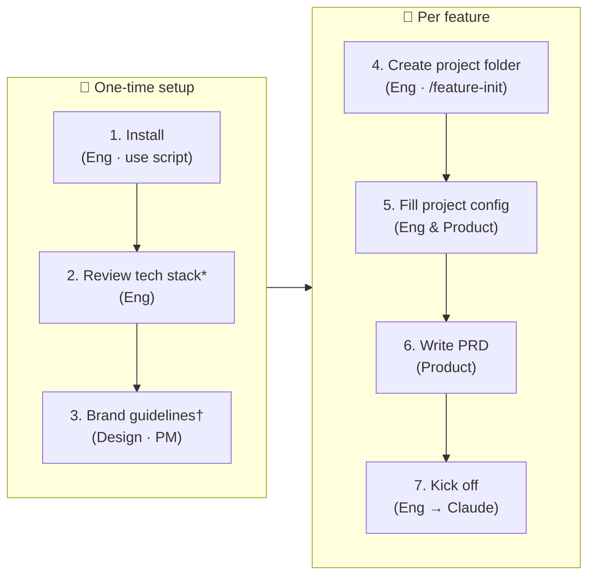

# Getting Started


_* revisit when stack changes · † default included, replace to match your brand_

---

| Step | What | How |
|------|------|-----|
| 1. Install | Pull agents, rules, skills into `.claude/` | `bash install.sh` |
| 2. Review tech stack | Folder paths, naming, tooling | Review default [tech-config.md](tech-config.md) |
| 3. Review brand guidelines | Color, typography, component tokens | Review default [brand-guidelines/SKILL.md](skills/brand-guidelines/SKILL.md) |
| 4. Create project folder | Scaffold `projects/master/` + feature folder | `/feature-init` in Claude Code |
| 5. Fill project config | Active agents, phases, overrides | Review default [workflow/project-config.md](template/feature/workflow/project-config.md) |
| 6. Write PRD ✍️ | **Feature requirements -- the agent's primary input** | Edit [product-specs/prd.md](template/feature/product-specs/prd.md) |
| 7. Kick off | Start agent collaboration | Tell Claude: _read and execute [kickoff-greenfield.md](template/kickoff-greenfield.md)_ (or [brownfield](template/kickoff-brownfield.md)) |

---

## 1. Install

Copy the latest agents, rules, and skills into your project:

```bash
bash install.sh          # pull from main
bash install.sh v1.2.0   # pin a specific tag or branch
```

This overwrites everything under `.claude/` (agents, rules, skills, template, guide docs) except your `settings.json`. Commit the result to lock the version.

---

## 2. Review tech stack (optional)

Open `.claude/tech-config.md` and update it to match your project -- folder paths, naming conventions, tooling choices, and team norms. Do this once after first install, and revisit whenever your project's conventions change.

`install.sh` automatically wires it into your `CLAUDE.md` so agents load it every session.

---

## 3. Brand guidelines (optional)

A default brand is already included at `.claude/skills/brand-guidelines/SKILL.md` -- Off-White + Deep Teal, Plus Jakarta Sans, full light/dark token set. You can use it as-is or replace it with your own.

To preview it, open `.claude/skills/brand-guidelines/previews/default-brand.html` in a browser.

To update: edit `SKILL.md` with your product's color palette, typography, spacing, and component states. The Designer, FE, PM, and QA agents all read it before producing any UI work -- changes take effect immediately on the next session.

---

## 4. Create a project folder (`/feature-init`)

Run the feature-init skill in Claude Code:

```
/feature-init
```

It will create `projects/master/` from the template if it doesn't exist, prompt you for a feature name, and scaffold `projects/YYYYMMDD-feature-name/`. Aborts if the feature folder already exists.

This produces:

```
projects/
├── master/                             # consolidated product baseline -- always current
│   ├── product-specs/
│   │   └── prd.md                      # full PRD merged across all shipped features
│   └── mocks/                          # current UI mocks
└── YYYYMMDD-feature-name/
    ├── generated-docs/                 # all artifacts, flat, kebab-case (e.g. be-plan.md, api-contract.md)
    │   └── mocks/                      # design mocks (HTML, images, Excalidraw)
    ├── product-specs/                  # PRD and other product artifacts
    └── workflow/
        ├── project-config.md           # you fill this in before kicking off
        ├── kickoff-plan.md             # agent generates at kickoff; you review and approve
        ├── human-checkpoints.md        # seeded at kickoff; you check off milestone gates
        └── implementation-plan.md      # EM generates as checklist; agents check off steps
```

---

## 5. Fill in project-config.md (optional)

Before any agent starts work, fill in `workflow/project-config.md`. This is the single place where you configure how the project runs -- which agents are active, which phases to skip, and any deviations from the default collaboration pattern.

You can also include handwritten notes, photos of whiteboard sketches, or links to Excalidraw diagrams in the **Additional context** section. Agents must respect and factor all of this into `implementation-plan.md`.

See the template for a complete example.

---

## 6. Fill in product-specs/prd.md

Write the PRD for this feature in `product-specs/prd.md`. This is the PM's input -- what to build and why. The kickoff prompt reads it directly, so agents will not proceed correctly without it.

If you are starting greenfield with no PRD yet, you can engage the PM agent first to help write it before running the kickoff.

---

## 7. Kick off

Pick the right kickoff file from `template/`:

- **Greenfield** (new project from scratch): `template/kickoff-greenfield.md`
- **Brownfield** (new feature on existing codebase): `template/kickoff-brownfield.md`

Open the file, fill in any `[placeholders]`, then tell Claude:

> Read and execute `template/kickoff-greenfield.md` (or `kickoff-brownfield.md`).

Claude will read your `project-config.md` and `product-specs/prd.md`, then produce `workflow/kickoff-plan.md` for your review before any work begins.
