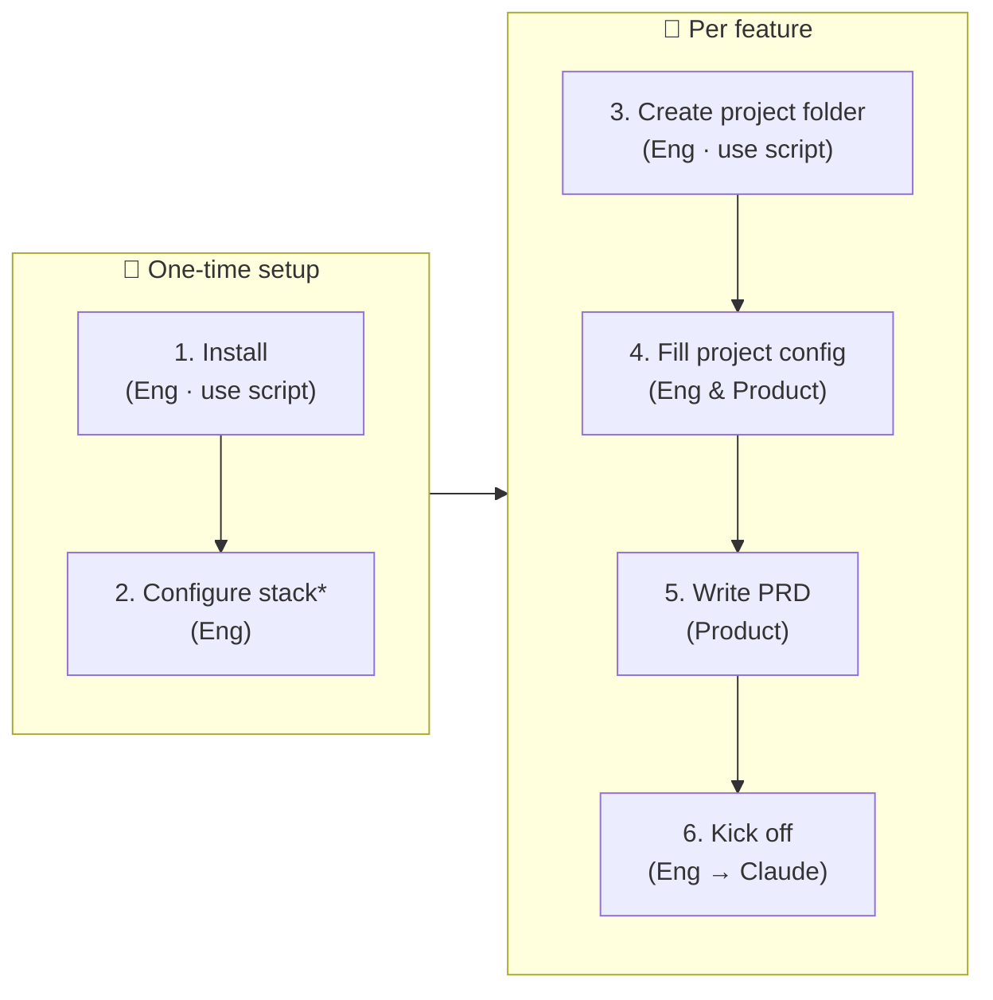

# Getting Started


_* revisit when stack changes_

## 1. Install

Copy the latest agents, rules, and skills into your project:

```bash
bash scripts/sync.sh          # pull from main
bash scripts/sync.sh v1.2.0   # pin a specific tag or branch
```

This overwrites everything under `.claude/` (agents, rules, skills, template, guide docs) except your `settings.json`. Commit the result to lock the version.

---

## 2. Configure your stack

Open `.claude/tech-config.md` and update it to match your project -- folder paths, naming conventions, tooling choices, and team norms. Do this once after first install, and revisit whenever your project's conventions change.

Then add it to your project's `CLAUDE.md` so agents load it automatically every session:

```markdown
@.claude/tech-config.md
```

---

## 3. Create a project folder

Run the setup script -- it handles both:

```bash
bash scripts/new-feature.sh
```

It will create `projects/master/` from the template if it doesn't exist, prompt you for a feature name, and scaffold `projects/YYYYMMDD-feature-name/`. Aborts if the feature folder already exists.

This produces:

```
projects/
├── master/                             # consolidated product baseline -- always current
│   ├── product-specs/
│   │   └── prd.md                      # full PRD merged across all shipped features
│   └── mocks/                          # current UI mocks
└── YYYYMMDD-feature-name/
    ├── generated-docs/                 # all artifacts, flat, kebab-case (e.g. be-plan.md, api-contract.md)
    │   └── mocks/                      # design mocks (HTML, images, Excalidraw)
    ├── product-specs/                  # PRD and other product artifacts
    └── workflow/
        ├── project-config.md           # you fill this in before kicking off
        ├── kickoff-plan.md             # agent generates at kickoff; you review and approve
        ├── implementation-plan.md      # EM generates; you review and approve
        └── implementation-plan-tracker.md # agent progress tracker
```

---

## 4. Fill in project-config.md

Before any agent starts work, fill in `workflow/project-config.md`. This is the single place where you configure how the project runs -- which agents are active, which phases to skip, and any deviations from the default collaboration pattern.

You can also include handwritten notes, photos of whiteboard sketches, or links to Excalidraw diagrams in the **Additional context** section. Agents must respect and factor all of this into `implementation-plan.md`.

See the template for a complete example.

---

## 5. Fill in product-specs/prd.md

Write the PRD for this feature in `product-specs/prd.md`. This is the PM's input -- what to build and why. The kickoff prompt reads it directly, so agents will not proceed correctly without it.

If you are starting greenfield with no PRD yet, you can engage the PM agent first to help write it before running the kickoff.

---

## 6. Kick off

Pick the right kickoff file from `template/`:

- **Greenfield** (new project from scratch): `template/kickoff-greenfield.md`
- **Brownfield** (new feature on existing codebase): `template/kickoff-brownfield.md`

Open the file, fill in any `[placeholders]`, then tell Claude:

> Read and execute `template/kickoff-greenfield.md` (or `kickoff-brownfield.md`).

Claude will read your `project-config.md` and `product-specs/prd.md`, then produce `workflow/kickoff-plan.md` for your review before any work begins.
