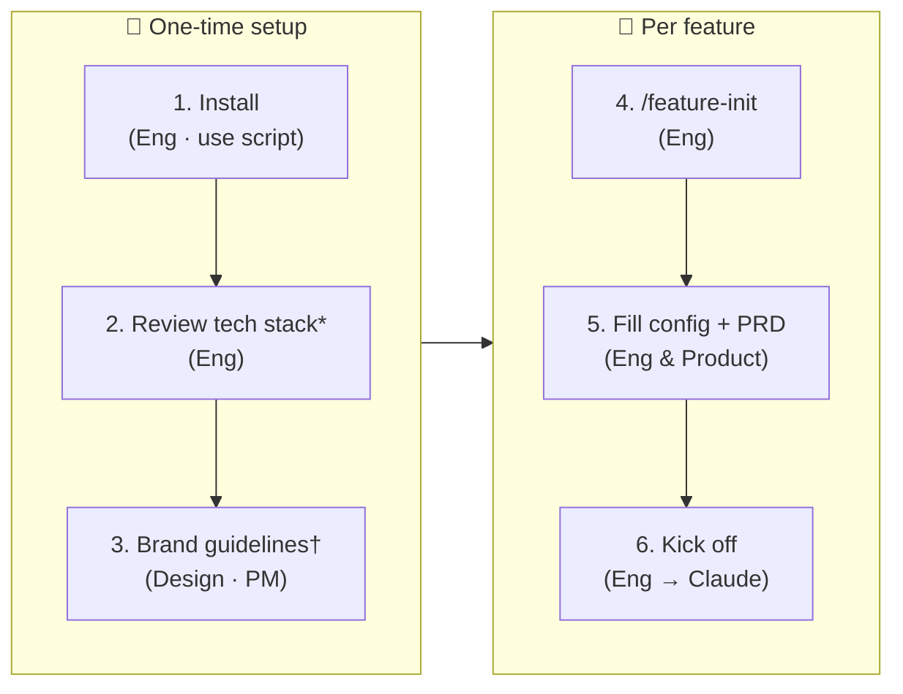

# Getting Started

## Every feature

1. Run `/feature-init` in Claude Code. It scaffolds `projects/master/` on the first run and `projects/YYYYMMDD-feature-name/` each time.
2. Fill in two files inside the new feature folder. `workflow/feature-workflow-config.md` sets the active agents, phases to skip, and any overrides. `product-specs/prd.md` is the PRD: what to build and why.
3. Open [kickoff-prompt.md](template/kickoff-prompt.md), set the Feature folder path at the top, then tell Claude:
   > Read and execute `template/kickoff-prompt.md`.

Claude reads your config and PRD, produces `workflow/kickoff-plan.md` for your review, and waits for your approval before any work begins.

---

## First-time setup

### Install

Copy agents, rules, skills, and templates into your project:

```bash
bash install.sh          # pull from main
bash install.sh v1.2.0   # pin a specific tag or branch
```

This overwrites everything under `.claude/` except `settings.json`. Commit the result to lock the version.

### Tech stack (optional)

Open [tech-config.md](tech-config.md) and update it to match your project: folder paths, naming conventions, tooling choices. Do this once after install and revisit when conventions change.

### Brand guidelines (optional)

A default brand is included at [skills/brand-guidelines/SKILL.md](skills/brand-guidelines/SKILL.md) (Off-White + Deep Teal, Plus Jakarta Sans, full light/dark token set). Preview it at [skills/brand-guidelines/previews/default-brand.html](skills/brand-guidelines/previews/default-brand.html).

To use your own: replace `SKILL.md` with your color palette, typography, spacing, and component states. Designer, FE, PM, and QA agents all read it before producing any UI work.

---

## How it works



_* revisit when stack changes · † default included, replace to match your brand_
