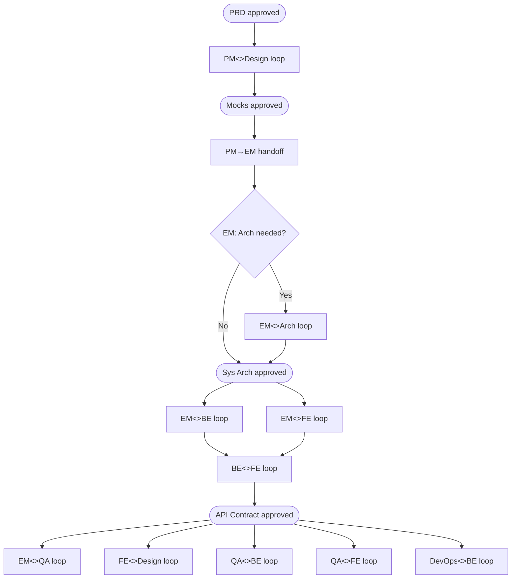

# Rule: Collaboration Loops

Every role-pair loop below is a named, bounded process with a clear initiator, an iterating pair, and a hard exit condition. When a kickoff plan or workflow includes one of these loops, it must appear as discrete steps -- not collapsed into a single checkpoint line.

EM is the central feedback and approval hub for all engineering loops. Every BE, FE, and QA/SDET loop routes through EM -- not directly between peers -- for sign-off before proceeding.

## Collaboration map

---

## Loop definitions

### PM<>Design loop

**Trigger:** PM's PRD is approved.
**Steps:**
1. PM hands off approved PRD to Designer with a written summary of key flows and edge cases.
   Designer reads `brand-guidelines` before producing anything. All mocks must use brand tokens only.
2. Designer produces initial mocks and returns them to PM for review.
3. PM and Designer iterate -- PM raises product/scope concerns, Designer raises design/feasibility concerns -- until both are satisfied.
4. Designer finalizes mocks.
5. PM reviews the final mocks and sets `Status: Approved`. Loop ends here.
**Loop exit:** PM sets `Status: Approved` on the mocks.
**Followed by (separate checkpoint):** Human reviews PM-approved mocks and confirms before EM begins eng planning. This is a kickoff plan checkpoint, not part of the loop itself.

---

### PM→EM handoff

**Trigger:** Human approves mocks and confirms the checkpoint.
**Steps:**
1. PM hands off approved PRD and approved mocks to EM with a written summary of scope, key flows, and any open questions.
2. EM reviews the PRD and mocks and decides whether Arch engagement is needed:
   - **Arch needed** (new infra, unfamiliar tech, significant scale or security concerns, cross-system impact) → proceed to EM<>Arch loop.
   - **Arch not needed** (well-understood domain, no new infra, incremental feature on existing stack) → EM proceeds directly to HLD and eng planning.
3. EM records the decision and rationale in `workflow/project-config.md` under `Collaboration overrides` (if skipping Arch) or leaves Arch active in the roster (if engaging).
**Exit:** EM has made and recorded the arch engagement decision.

---

### EM<>Arch loop

**Trigger:** PM→EM handoff complete and EM has determined Arch engagement is needed.
**Steps:**
1. EM shares the PRD, approved mocks, and constraints with Arch.
2. Arch produces system architecture proposal as two files: `sys-arch.md` (source of truth) and `sys-arch.html` (self-contained, inline CSS, renders diagrams and tables for stakeholder review).
3. EM reviews and provides feedback -- delivery/feasibility concerns, structural risks -- Arch incorporates and returns.
4. Repeat until EM is satisfied.
5. Arch finalizes the architecture doc and hands it back to EM.
**Exit:** EM sets `Status: Approved` on the arch doc. Downstream: BE Detailed Design, FE Detailed Design, DevOps infra planning.

---

### EM<>BE loop

**Trigger:** System architecture is approved.
**Steps:**
1. EM shares `hld.md` + `hld.html`, approved arch, and delivery constraints with BE.
2. BE produces detailed design: bi-level plan for DB work and IAC, DB schema, core work breakdown, IAC, creates GH issues in alignment with delivery phases.
3. EM reviews and provides feedback -- scope, sequencing, risk -- BE incorporates and returns.
4. Repeat until EM is satisfied.
5. BE finalizes the detailed design doc and GH issues.
**Exit:** EM sets `Status: Approved` on the detailed design. Downstream: API contract, BE implementation.

---

### EM<>FE loop

**Trigger:** Mocks are approved and HLD is available.
**Steps:**
1. EM shares `hld.md` + `hld.html`, approved mocks, and constraints with FE.
2. FE produces FE Detailed Design (component tree, state model, routing, data-fetching strategy).
3. EM reviews and provides feedback -- delivery concerns, complexity -- FE incorporates and returns.
4. Repeat until EM is satisfied.
5. FE finalizes the FE Detailed Design doc.
**Exit:** EM sets `Status: Approved` on the FE Detailed Design doc. Downstream: FE component implementation, API contract.

---

### BE<>FE loop

**Trigger:** BE Detailed Design and FE Detailed Design are both approved.
**Steps:**
1. BE produces a draft API contract (endpoints, request/response shapes, error codes).
2. BE and FE iterate on the contract -- FE raises integration concerns, BE raises implementation constraints -- until both are aligned.
3. Both parties submit the agreed contract to EM for review.
4. EM reviews and provides feedback -- missing cases, structural concerns, phase alignment -- BE/FE incorporate and resubmit if needed.
5. Repeat step 4 until EM is satisfied.
**Loop exit:** EM sets `Status: Approved` on the API contract. Downstream: BE endpoint implementation, FE integration.

---

### EM<>QA loop

**Trigger:** BE and FE artifacts are approved and available for test planning.
**Steps:**
1. EM shares delivery phases, API contract, and approved specs with QA/SDET.
2. QA/SDET produces bi-level plan for automation: technical strategy, creates GH issues in alignment with delivery phases.
3. EM reviews and provides feedback -- coverage gaps, phase alignment, priority -- QA/SDET incorporates and returns.
4. Repeat until EM is satisfied.
5. QA/SDET finalizes the automation plan and GH issues.
**Exit:** EM sets `Status: Approved` on the automation plan. Downstream: QA automation work begins.

---

### FE<>Design loop

**Trigger:** FE begins implementing a screen that has approved mocks.
**Steps:**
1. FE flags any mock element that cannot be implemented as specified (technical constraint, accessibility issue, missing state).
2. Designer and FE agree on a resolution -- either FE adapts the implementation or Designer revises the mock.
3. If Designer revises the mock: the revised mock re-enters the PM<>Design loop. PM must review and set `Status: Approved` on the revision before FE proceeds. This is not optional.
4. If FE adapts the implementation: FE documents the deviation and both parties sign off.
**Loop exit:** All deviations resolved with explicit sign-off. No screen ships with an unresolved fidelity gap.

---

### QA<>PM loop

**Trigger:** PRD is approved, before QA authors the test plan.
**Steps:**
1. QA reviews each AC and flags any that are ambiguous, untestable, or missing edge cases.
2. PM and QA iterate -- PM clarifies intent, QA proposes testable restatements -- until every AC has a clear pass/fail condition.
3. PM updates the PRD with the refined ACs.
**Exit:** QA confirms all ACs are testable. QA proceeds to author the test plan.

---

### QA<>BE loop

**Trigger:** QA begins automation work against BE implementation.
**Steps:**
1. QA flags any test-blocking issue (missing endpoint, incorrect response shape, broken env) directly to BE.
2. BE resolves and notifies QA.
3. QA confirms the blocker is cleared before continuing.
**Exit:** No open BE test-blocking issues. QA pipeline proceeds.

---

### QA<>FE loop

**Trigger:** QA begins automation work against FE implementation.
**Steps:**
1. QA flags any test-blocking issue (missing component, incorrect state, broken env) directly to FE.
2. FE resolves and notifies QA.
3. QA confirms the blocker is cleared before continuing.
**Exit:** No open FE test-blocking issues. QA pipeline proceeds.

---

### DevOps<>BE loop

**Trigger:** BE implementation is ready for deployment target definition.
**Steps:**
1. DevOps provides deployment targets, environment configs, and runbook drafts.
2. DevOps and BE iterate -- BE raises app-level constraints, DevOps raises infra constraints -- until the deployment contract is agreed.
3. DevOps finalizes infra config and runbook.
**Exit:** Both parties sign off. Downstream: CI/CD pipeline wiring, staging deployment.

---

## How to use this in a kickoff plan

In section 3 (Agent collaboration plan) of the kickoff plan, identify which loops are active for this feature and describe each one -- spell out the steps, do not reference a loop by name only. For `human-checkpoints.md`, include only the human-facing gate at the end of each loop (the point where a human must approve before downstream work is unblocked). Internal agent-to-agent steps within a loop belong in `implementation-plan.md` only.

Inactive loops (roles not in scope for this feature) must be noted as skipped, not silently omitted.
