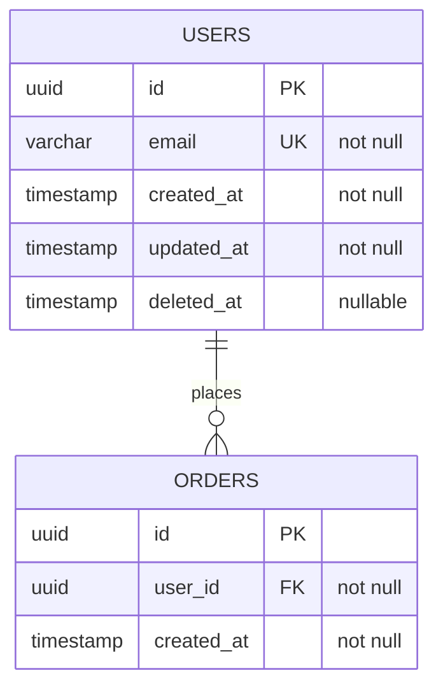

# Rule: ER Diagram Snapshot

A current ER diagram must be maintained at `db/er-diagram.md`. It is the authoritative snapshot of the live schema -- not a design artifact, not a draft.

## When to update

Update `db/er-diagram.md` in the same commit as any schema change:

- New table added
- Table renamed or dropped
- Column added, renamed, dropped, or type changed
- Foreign key or unique constraint added or removed

A schema commit without a corresponding ER diagram update is incomplete and must not be merged.

## What the diagram must include

For each table:
- Table name
- All columns with type and nullability
- Primary key
- Foreign keys and the tables they reference
- Notable indexes (unique constraints, composite indexes)

## Format

Use Mermaid `erDiagram` syntax so the diagram renders in GitHub and most markdown viewers:

## Ownership

- **BE** updates the diagram when writing schema files or migrations.
- **EM** verifies the diagram is current during schema approval (see `contract-first-rule.md`).
