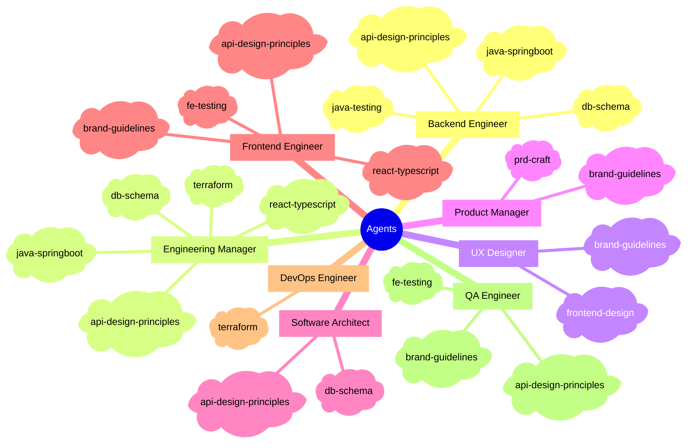
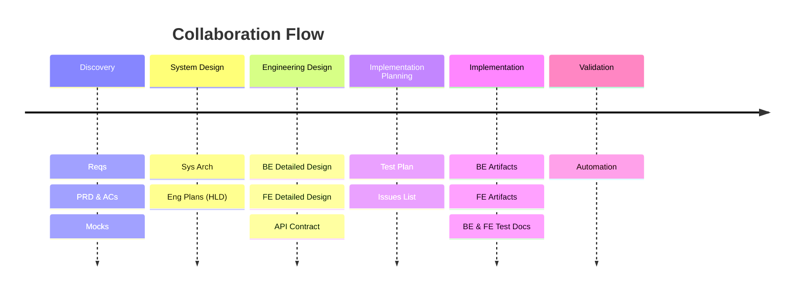
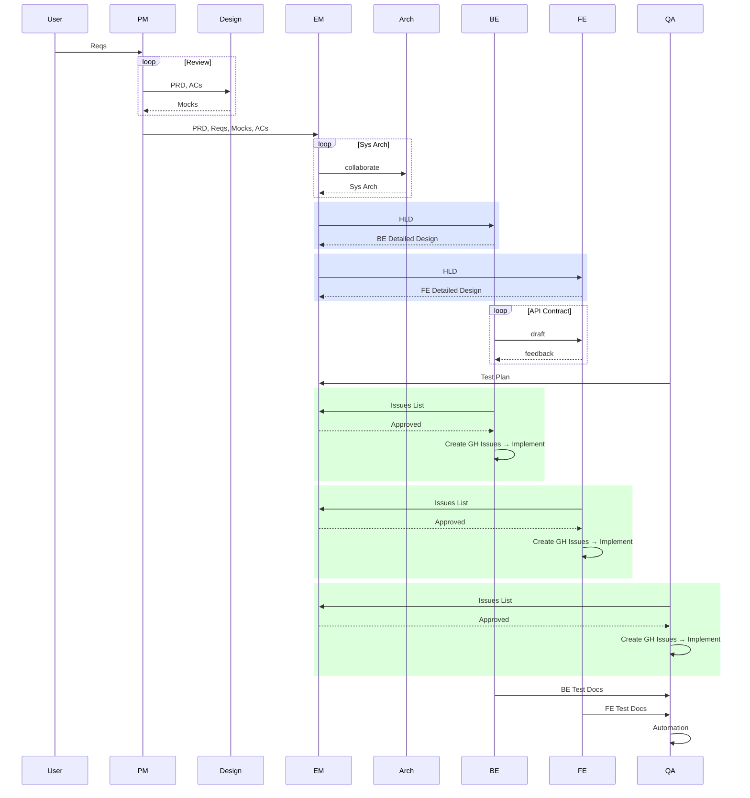

# Claude Sub-Agent Team

A collection of reusable, generic Claude Code sub-agent definitions for a software engineering team. Each agent represents a distinct engineering or product role with well-defined expertise, collaboration style, and hard constraints.

See [GETTING-STARTED.md](.claude/GETTING-STARTED.md) to install and run your first project.

## Project folder structure

```
projects/
├── master/                             # consolidated product baseline (copy once from template/master)
│   ├── product-specs/
│   │   └── prd.md                      # full PRD merged across all shipped features
│   └── mocks/                          # current UI mocks
└── YYYYMMDD-feature-name/              # copy per feature from template/feature
    ├── generated-docs/                 # all artifacts, flat, kebab-case
    │   └── mocks/                      # design mocks
    ├── product-specs/                  # PRD and other product artifacts
    └── workflow/
        ├── project-config.md           # human fills in at kickoff
        ├── kickoff-plan.md             # agent generates at kickoff; human approves
        ├── human-checkpoints.md        # seeded at kickoff; human checks off milestone gates
        └── implementation-plan.md      # EM generates as checklist; agents check off steps
```

See `.claude/GETTING-STARTED.md` for the full walkthrough.

---

## Agents

| Agent | Description |
|-------|-------------|
| `senior-engineering-manager` | Owns architecture, delivery planning, API contracts, QA plan, and phase sign-off across all workstreams |
| `senior-product-manager` | Owns PRD and acceptance criteria; defines delivery phases and drives cross-functional alignment |
| `senior-software-architect` | Owns system-wide technical direction, structural integrity, and critical path design review |
| `senior-frontend-engineer` | Builds accessible, performant UI with full ownership of components, state, routing, and API integration (React 18, TypeScript, Redux Toolkit, Playwright) |
| `senior-backend-engineer` | Designs and implements the full backend stack including DB schema, API, auth, and Terraform infra |
| `senior-devops-engineer` | Owns CI/CD pipelines, cloud infrastructure (IaC), observability stack, and security posture end-to-end |
| `senior-qa-automation-engineer` | Owns full test pipeline including strategy, test files, CI wiring, and quality gates |
| `senior-ux-ui-designer` | Creates distinctive, production-grade interfaces and complete design artifacts |

Agent files live in `.claude/agents/` and are automatically loaded by Claude Code.

## Structure

Each agent definition covers:
- **Core expertise** -- role-specific skills, qualities, and standards
- **Collaboration** -- how this role works with each other role
- **Behavior** -- mindset, ownership, decision-making, and communication norms
- **Hard constraints** -- non-negotiable rules that govern the role
- **Commit conventions** -- role-specific commit rules, inline in the agent file

## Skills

Standalone domain skills live under `.claude/skills/{skill}/`, each with a `SKILL.md`. Agents reference skills in their `skills:` frontmatter. Skills load progressively: frontmatter at startup, body when triggered, referenced files on demand.

Skill names must be unique across all skill files.




## Collaboration map

Agents collaborate by exchanging artifacts. The Gatekeeper is the role with final say -- they review, raise concerns, and resolve with the owner before downstream work proceeds.

---

**Timeline** (phases and artifacts at a glance)



<details>
<summary>Sequence diagram (who hands what to whom, in order)</summary>



</details>

### Discovery
| Artifact | Owner | Key collaborators | Gatekeeper |
|---|---|---|---|
| Reqs | User | PM gathers | -- |
| PRD, ACs | PM | EM reviews | PM |
| Mocks | Design | PM refines jointly | PM |

### System Design
| Artifact | Owner | Key collaborators | Gatekeeper |
|---|---|---|---|
| Sys Arch | Arch | EM drives, Arch authors | Arch |
| Eng Plans (HLD) | EM | Arch contributes, FE+BE align | EM |

### Engineering Design
| Artifact | Owner | Key collaborators | Gatekeeper |
|---|---|---|---|
| BE Detailed Design | BE | EM monitors; intercepts and collaborates to resolve on red flag | EM |
| FE Detailed Design | FE | EM monitors; intercepts and collaborates to resolve on red flag | EM |
| API Contract | FE + BE | EM monitors; intercepts and collaborates to resolve on red flag | EM |

### Implementation Planning
| Artifact | Owner | Key collaborators | Gatekeeper |
|---|---|---|---|
| Test Plan | QA | EM monitors; intercepts and collaborates to resolve on red flag | EM |
| Issues List | BE / FE / QA | EM signs off each list | EM |

### Implementation
| Artifact | Owner | Key collaborators | Gatekeeper |
|---|---|---|---|
| CI/CD Pipeline + IaC | DevOps | EM monitors; intercepts and collaborates to resolve on red flag | EM |
| BE Artifacts | BE | QA tests, Arch reviews, EM monitors; intercepts and collaborates to resolve on red flag | EM |
| FE Artifacts | FE | QA tests, EM monitors; intercepts and collaborates to resolve on red flag | EM |
| BE Test Docs | BE | QA consumes | EM |
| FE Test Docs | FE | QA consumes | EM |

### Validation
| Artifact | Owner | Key collaborators | Gatekeeper |
|---|---|---|---|
| Automation | QA | EM monitors; intercepts and collaborates to resolve on red flag | EM |
---

<details>
<summary>Step-by-step flow</summary>

1. **User** shares requirements with **PM**.
2. **PM** gathers requirements and produces the PRD and ACs.
3. **PM** sends PRD to **Design**, who creates Mocks. PM reviews and refines jointly with Design.
4. **PM** sends PRD, Reqs, Mocks, and ACs to **EM** to kick off engineering planning.
5. **EM** engages **Arch** and collaborates to produce Sys Arch based on PRD and system constraints.
6. **EM** authors Eng Plans (HLD) -- DB Schema, IAC, Core API, BE<>FE API contract, Feature sys design -- based on Sys Arch and PRD. Arch contributes; FE and BE align on scope.
7. **BE** authors BE Detailed Design (DB Schema, IAC, BE API, BE<>FE API contract) from the HLD.
8. **FE** authors FE Detailed Design (component design, state, routing, API integration) from the HLD.
9. **FE and BE** jointly author the API Contract, aligned on their Detailed Designs.
10. **QA** authors the Test Plan based on PRD, Mocks, and ACs.
11. **BE**, **FE**, and **QA** each independently author their own Issues List -- a hierarchical document breaking down their scope into individual GitHub issues, organized for human review. Each submits to **EM** for sign-off.
12. **EM** reviews and signs off on each Issues List. Once approved, each role creates the actual GH Issues and begins implementation.
13. **FE** implements FE Artifacts per FE Detailed Design and API Contract. **BE** implements BE Artifacts per BE Detailed Design and API Contract.
14. **FE** and **BE** each produce Test Docs for QA to use in automation.
15. **QA** authors the automation suite against FE/BE artifacts and test docs.

</details>

## Rules

Rules in `.claude/rules/` apply automatically to every session:

- **workflow-phases-rule** -- multi-step work must be defined as a phased workflow with numbered steps, responsible roles, and concrete artifacts
- **progress-tracking-rule** -- `implementation-plan.md` is authored as a checklist; agents check off steps and resume from it directly
- **backlog-reporting-rule** -- append discovered bugs and tech debt to `BACKLOG.md` triage table
- **contract-first-rule** -- governs agent-to-agent technical contracts (HLD, DB Schema, BE Detailed Design, FE Detailed Design, API Contract, Test Plan, Issues Lists); human milestone gates are tracked in `workflow/human-checkpoints.md`
- **er-diagram-rule** -- maintain a current ER diagram at `db/er-diagram.md`; update it in the same commit as any schema change
- **api-review-rule** -- run through the API design checklist before declaring any REST API design complete
- **db-review-rule** -- run through the DB schema checklist before declaring any schema change complete
- **test-review-rule** -- run through the test checklist before merging any test code
- **product-baseline-rule** -- maintain a consolidated master PRD and mocks at `projects/master/`; PM and Designer are blocked from starting a new feature until it is current

## Usage guide

```bash
bash scripts/sync.sh          # sync latest
bash scripts/sync.sh v1.2.0   # pin a tag or branch
```

This clones the upstream repo and overwrites everything under `.claude/` (agents, rules, skills, template, guide docs) except your `settings.json`. Commit the result to lock the version.

Default file locations (e.g. `db/er-diagram.md`, `BACKLOG.md`) can be overridden in your project's `CLAUDE.md`. See [CONTRIBUTING.md](CONTRIBUTING.md) for details.