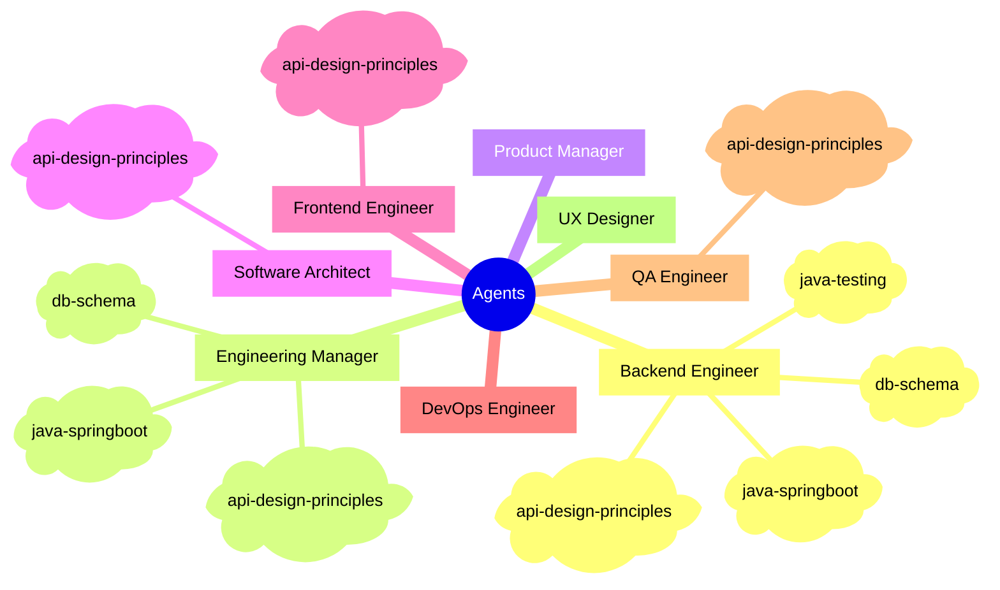

# Claude Sub-Agent Team

A collection of reusable, generic Claude Code sub-agent definitions for a software engineering team. Each agent represents a distinct engineering or product role with well-defined expertise, collaboration style, and hard constraints.

## Agents

| Agent | Description |
|-------|-------------|
| `senior-engineering-manager` | Owns architecture, delivery planning, API contracts, QA plan, and phase sign-off across all workstreams |
| `senior-product-manager` | Owns PRD and acceptance criteria; defines delivery phases and drives cross-functional alignment |
| `senior-software-architect` | Owns system-wide technical direction, structural integrity, and critical path design review |
| `senior-frontend-engineer` | Builds accessible, performant UI with full ownership of components, state, routing, and API integration |
| `senior-backend-engineer` | Designs and implements the full backend stack including DB schema, API, auth, and Terraform infra |
| `senior-devops-engineer` | Owns CI/CD pipelines, cloud infrastructure (IaC), observability stack, and security posture end-to-end |
| `senior-qa-automation-engineer` | Owns full test pipeline including strategy, test files, CI wiring, and quality gates |
| `senior-ux-ui-designer` | Creates distinctive, production-grade interfaces and complete design artifacts |

Agent files live in `.claude/agents/` and are automatically loaded by Claude Code.

## Structure

Each agent definition covers:
- **Core expertise** -- role-specific skills, qualities, and standards
- **Collaboration** -- how this role works with each other role
- **Behavior** -- mindset, ownership, decision-making, and communication norms
- **Hard constraints** -- non-negotiable rules that govern the role
- **Commit conventions** -- role-specific commit rules, inline in the agent file

## Skills

Standalone domain skills live under `.claude/skills/{skill}/`, each with a `SKILL.md`. Agents reference skills in their `skills:` frontmatter. Skills load progressively: frontmatter at startup, body when triggered, referenced files on demand.

Skill names must be unique across all skill files.



## Collaboration map

Agents collaborate by exchanging artifacts. The Gatekeeper is the role with final say -- they review, raise concerns, and resolve with the owner before downstream work proceeds.

| Artifact | Owner | Who Does What | When Produced | Gatekeeper |
|---|---|---|---|---|
| Req | User | **PM**: gathers via User<>PM session, uses as input to PRD | Before project starts | -- |
| PRD, AC | PM | **PM**: sends to Design to generate Mocks<br>**PM**: sends PRD, Req, Mocks, AC to EM to kick off Eng planning<br>**PM**: collaborates with FE, BE, QA on scope and AC | After req gathering | EM |
| Mocks | Design | **Design**: creates from PRD<br>**PM**: reviews and refines jointly with Design | After PRD | PM |
| Sys Arch | Arch | **Arch**: authors based on PRD and constraints<br>**EM**: contributes and co-reviews<br>**BE**: contributes domain input | After PRD | Arch |
| Eng Plans (HLD) | EM | **EM**: authors DB Schema, IAC, Core API, BE<>FE API contract, Feature sys design -- all high-level<br>**Arch**: contributes<br>**FE, BE**: receive and align on scope | After Sys Arch | EM |
| BE Detailed Design | BE | **BE**: authors detailed DB Schema, IAC, BE API, BE<>FE API contract from HLD<br>**EM**: monitors, intercepts on red flag | After Eng Plans | EM |
| FE Detailed Design | FE | **FE**: authors detailed component design, state, routing, API integration from HLD<br>**EM**: monitors, intercepts on red flag | After Eng Plans | EM |
| API Contract | FE + BE | **FE + BE**: jointly author, aligned on Detailed Designs<br>**EM**: monitors, intercepts on red flag | After Detailed Designs | EM |
| Test Plan / Acceptance | QA | **QA**: authors based on PRD, Mocks, AC<br>**EM**: monitors, intercepts on red flag | After Eng Plans | EM |
| FE Artifacts | FE | **FE**: implements per Detailed Design and API Contract<br>**QA**: reviews and tests<br>**EM**: monitors, intercepts on red flag | During implementation | EM |
| BE Artifacts | BE | **BE**: implements per Detailed Design and API Contract<br>**QA**: reviews and tests<br>**Arch**: reviews structural decisions<br>**EM**: monitors, intercepts on red flag | During implementation | EM |
| Automation | QA | **QA**: authors test suite against FE/BE artifacts<br>**EM**: monitors, intercepts on red flag | After implementation | EM |

## Rules

Rules in `.claude/rules/` apply automatically to every session:

- **workflow-phases-rule** -- multi-step work must be defined as a phased workflow with numbered steps, responsible roles, and concrete artifacts
- **progress-tracking-rule** -- maintain a `PHASES-CHECKLIST.md` alongside any workflow; verify artifacts before checking off steps
- **backlog-reporting-rule** -- append discovered bugs and tech debt to `BACKLOG.md` triage table
- **contract-first-rule** -- no role may begin work that depends on an upstream artifact (PRD, DB schema, API contract) until it is explicitly approved
- **er-diagram-rule** -- maintain a current ER diagram at `db/er-diagram.md`; update it in the same commit as any schema change
- **api-review-rule** -- run through the API design checklist before declaring any REST API design complete
- **db-review-rule** -- run through the DB schema checklist before declaring any schema change complete
- **test-review-rule** -- run through the test checklist before merging any test code

## Usage guide

```bash
bash scripts/sync-agents.sh          # sync latest
bash scripts/sync-agents.sh v1.2.0   # pin a tag or branch
```

This clones the upstream repo and overwrites `.claude/agents`, `.claude/rules`, and `.claude/skills` in your project. Commit the result to lock the version.

Default file locations (e.g. `db/er-diagram.md`, `BACKLOG.md`) can be overridden in your project's `CLAUDE.md`. See [CONTRIBUTING.md](CONTRIBUTING.md) for details.